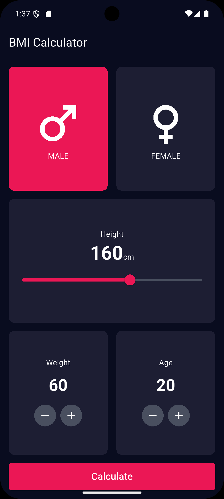

# 🧮 BMI Calculator

A simple **Flutter** application that calculates your **Body Mass Index (BMI)** and classifies the result into categories such as Underweight, Normal, Overweight, and Obese.

---

## 📸 Screenshots

<p align="center">
  
  
</p>

---

## 🚀 Features
- Input height and weight.
- Calculates BMI instantly.
- Categorizes results (Underweight, Normal, Overweight, Obese).
- Clean and responsive UI.

---

## 🛠 Installation

1. Clone the repository:
   ```bash
   git clone https://github.com/your-username/bmi_calculator.git
